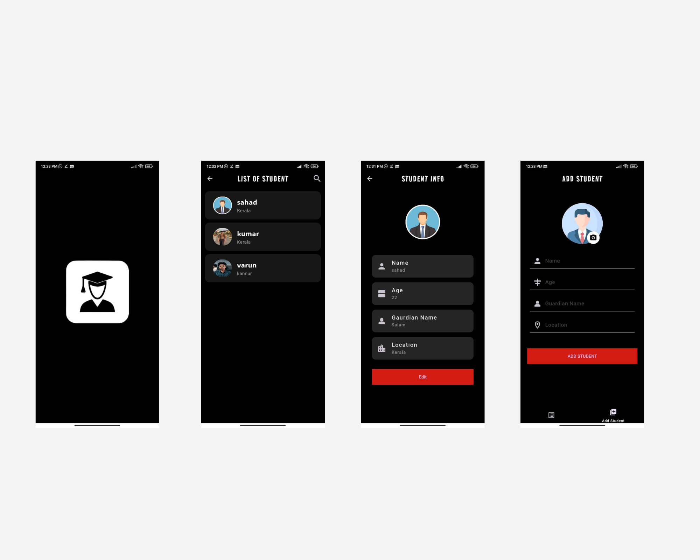

# Student Management App

This project is a Student Management application developed to simplify the process of managing student information for educational institutions. The app provides basic CRUD (Create, Read, Update, Delete) functionality for handling student details, allowing administrators or teachers to efficiently manage student records.

### Key Features:

#### Student CRUD Operations
#### User-friendly Interface
#### Data Validation
#### Search

### Technology Stack:

#### Framework:Flutter
#### database:Hive
#### State Management: Provider

## App Screen:

